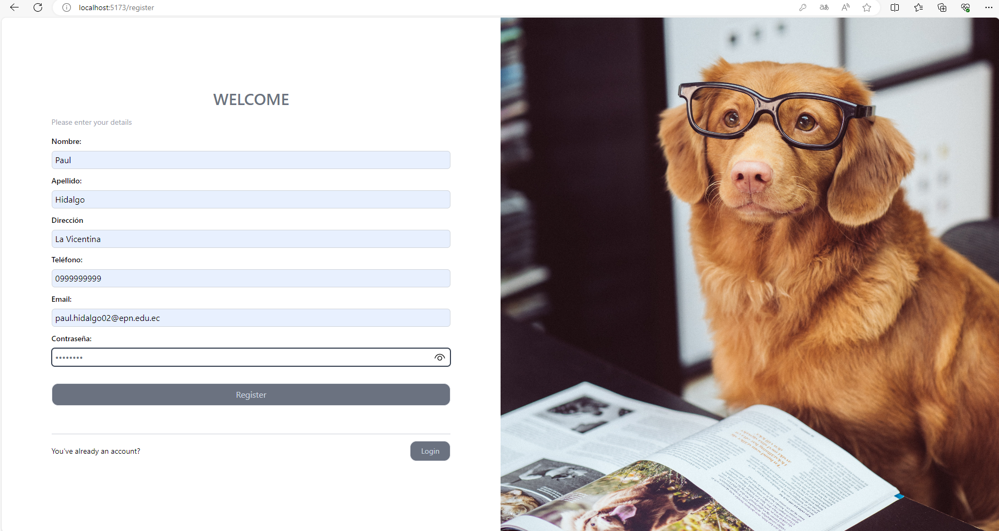
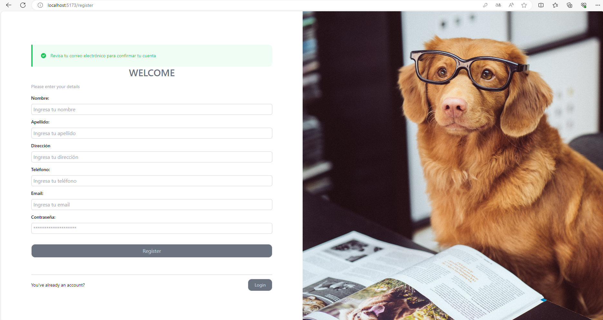
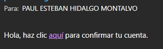
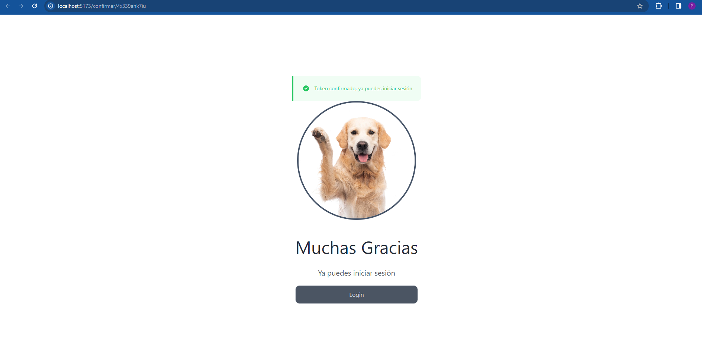
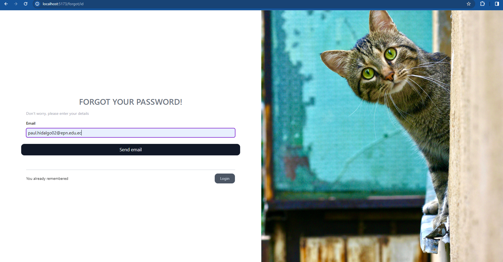
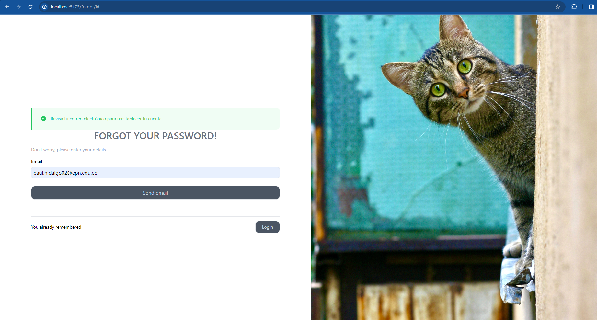

# FULLSTACK Veterinary management

Conexión de un Frontend con el backend para el manejo de un sistema de veterinaria.

## Autor

- [@IsmaelNovillo](https://www.github.com/IsmaelNovillo)

## Capturas

